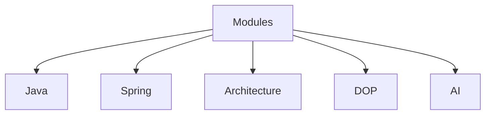

# Repository Architecture

The repository is organized by engineering domains.

Each module is self-contained and follows the same structure.

```mermaid
flowchart TD

Modules --> Java
Modules --> Spring
Modules --> Architecture
Modules --> DOP
Modules --> AI
```
